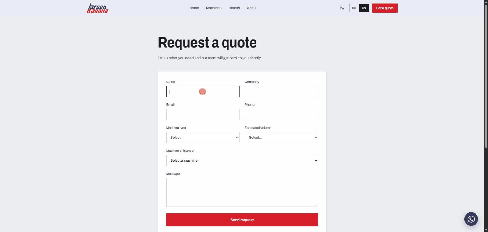
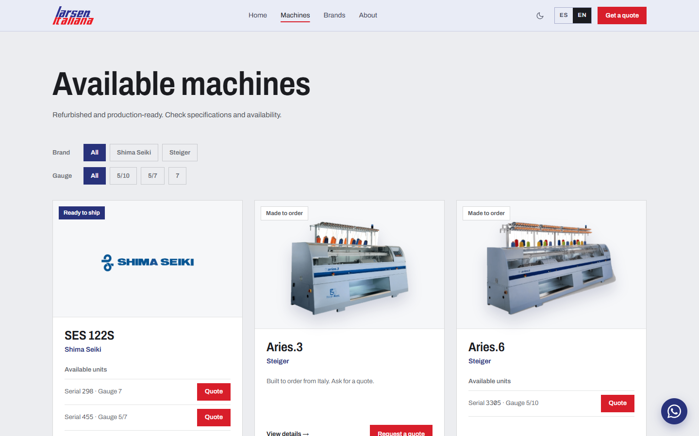
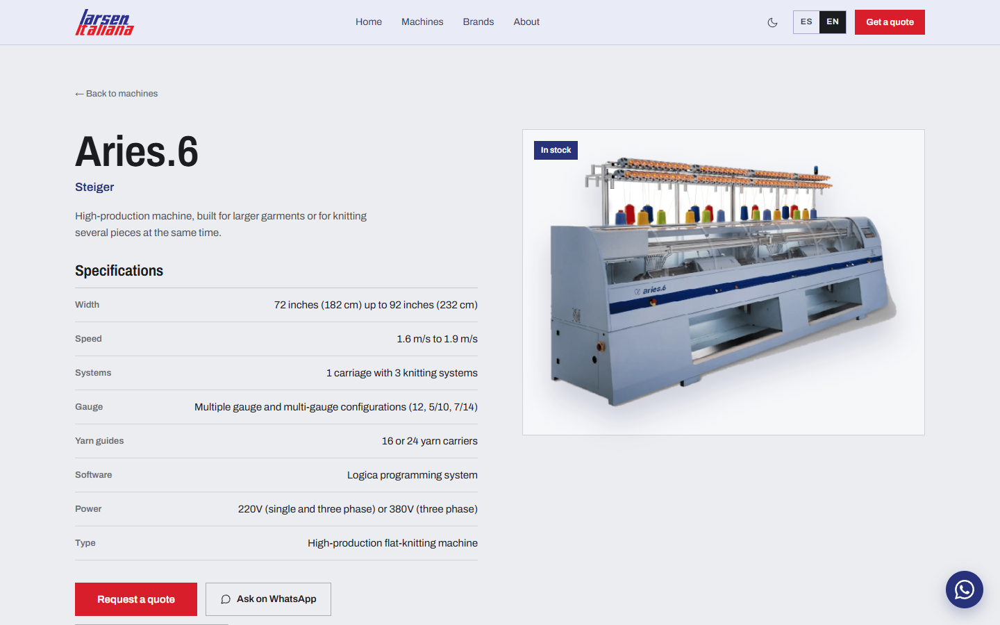
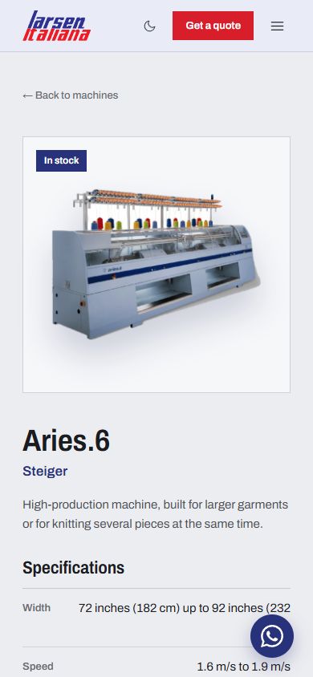
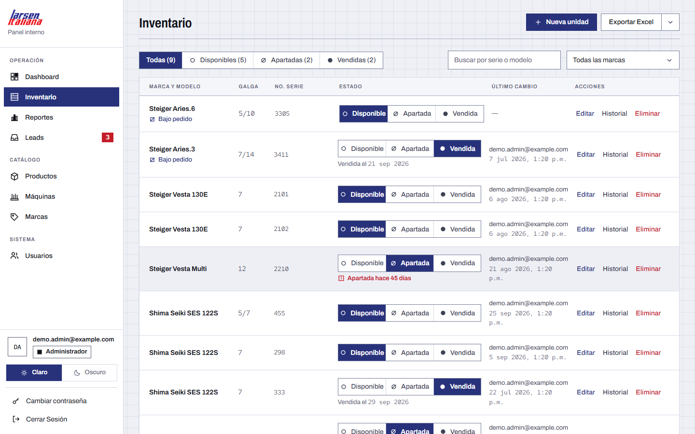
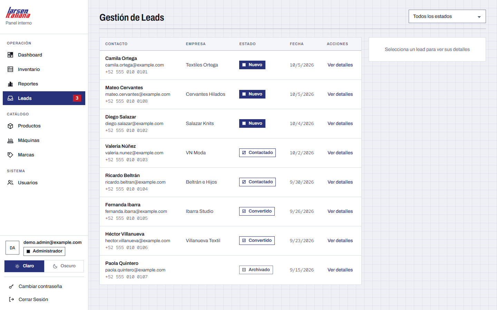
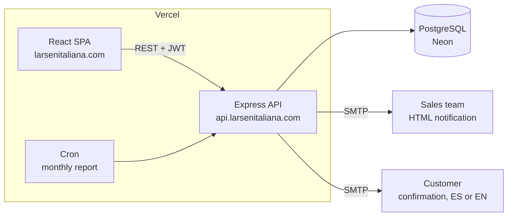

# Larsen Italiana

A bilingual (ES/EN) lead-generation site and inventory back office for Larsen Italiana, a distributor of rebuilt industrial knitting machines. Visitors browse the catalog and request a quote; the sales team gets an email, and staff manage leads and physical stock from a private panel.

[](assets/readme/quote-flow.gif)

**React 19** · TypeScript · Vite · Tailwind 4 · Express · Prisma + PostgreSQL (Neon) · Zod · JWT · Nodemailer · Vitest + Jest · Vercel

## Try it

Live at **[larsenitaliana.com](https://larsenitaliana.com)**. The admin panel is private: there is no public registration, and the first account comes from the seed script.

<table>
  <tr>
    <td width="40%"></td>
    <td width="40%"></td>
    <td width="20%"></td>
  </tr>
  <tr>
    <td width="40%"></td>
    <td width="40%"></td>
    <td width="20%"></td>
  </tr>
</table>

Admin screenshots use fictitious data.

## How it works



- A quote request is stored first, then two emails go out in parallel: an HTML notification for the sales team (Reply, Call and "View in panel" buttons) and an automatic confirmation to the customer in the language they browsed in.
- An email failure never fails the saved lead. If the API itself is unreachable, the form falls back to EmailJS.
- Machine pages generate a one-page spec-sheet PDF in the browser, and the download is recorded as a lead.
- Two roles: `ADMIN` does everything; `INVENTARIO` can only work on stock. Every inventory change is written to an audit trail.
- GA4 events track machine views, WhatsApp and phone clicks, quote submissions and spec downloads.

## Decisions, and why

- **Typed i18n, no library.** [`dictionary.ts`](src/i18n/dictionary.ts) defines `es` as the canonical shape and the type forces `en` to match, so a missing translation fails the build instead of showing up in production.
- **PDFs stay out of the main bundle.** [`specSheet.ts`](src/services/specSheet.ts) imports jsPDF dynamically, so only people who click "download" pay for it.
- **Login throttling lives in the database.** Serverless instances share no memory, so failed attempts are counted per IP in a `login_attempts` table (5 per 15 minutes).
- **One Express app, two Vercel projects.** The same `app` runs locally with `tsx` and in production as the serverless handler in [`backend/api/index.ts`](backend/api/index.ts); the SPA and the API deploy independently.
- **Serial numbers are the identity of a unit.** Stock is one row per physical machine, unique per brand and serial. Internal notes never leave the admin API.
- **Ready for an ERP, without building one.** `InventoryUnit.externalId` is the hook for a future Odoo sync, so the schema won't need to change when that stage starts.

## Run it locally

Needs Node 20.19+ and a PostgreSQL database.

```bash
git clone https://github.com/EmilioPG13/Larsen-WebPage.git
cd Larsen-WebPage
npm install
cd backend && npm install

# Copy backend/.env.example to backend/.env and set DATABASE_URL, JWT_SECRET,
# ADMIN_EMAIL and ADMIN_PASSWORD (12+ characters).
npm run prisma:migrate
npm run seed
npm run dev          # API on http://localhost:3001
```

In a second terminal, from the repo root, create `.env` with `VITE_API_URL=http://localhost:3001/api`, then:

```bash
npm run dev          # site on http://localhost:3000, admin at /admin/login
```

SMTP is optional. Without it, leads are still saved and the emails are skipped with a warning. Every variable is documented in [`.env.example`](.env.example) and [`backend/.env.example`](backend/.env.example).

## Tests

```bash
npm test             # 249 tests, Vitest + Testing Library
cd backend && npm test   # 385 tests, Jest + Supertest
```

Manual QA steps are in [TESTING.md](TESTING.md).

## API at a glance

| Access | Routes |
| --- | --- |
| Public | `GET /api/products`, `/machines`, `/brands`, `/catalog` · `POST /api/leads` · `POST /api/auth/login` · `GET /health` |
| Signed in | `GET /api/auth/me` · `PUT /api/auth/password` |
| `ADMIN` + `INVENTARIO` | `/api/inventory`: list, create, edit, change status, unit history |
| `ADMIN` | Catalog writes (products, machines, brands) · leads · `/api/users` · inventory report and delete |
| Cron | `GET /api/cron/monthly-report`, protected by `CRON_SECRET` |

Data model: [`backend/prisma/schema.prisma`](backend/prisma/schema.prisma).

## Honest limitations

- The admin panel is Spanish only; the public site is ES/EN.
- Migrations are applied by hand with `prisma migrate deploy`, not on deploy.
- The monthly inventory report is still a plain-text email.
- `POST /api/contact` is legacy and no longer used by the UI.
- The ERP sync is a schema hook only; nothing talks to Odoo yet.

## About

Built by [Emilio Parra](https://github.com/EmilioPG13) for Larsen Italiana, with their permission. The source is shared as a portfolio piece. Larsen's name, logo and product photos belong to the company, and no license is granted to reuse them.
